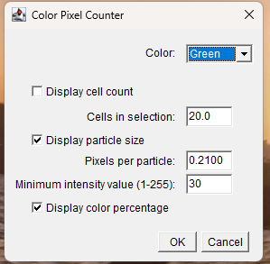

# FIJI Scripts

## Notes for usage of these scripts and necessary FIJI plug-ins

3 plugins are necessary (depending on which script is used). 

## For all scripts:
**1. Read and Write Excel package - https://imagej.net/plugins/read-and-write-excel & https://github.com/antinos/Read_and_Write_Excel_Modified**

This plugin can create an excel spreadsheet from a Results table in FIJI.

*see video - youtube.com/watch?v=dLkoB25MTIY&time_continue=0&source_ve_path=NzY3NTg&embeds_referring_euri=https%3A%2F%2Fimagej.net%2F*

Instructions: Help --> Update.. --> Manage Update Sites --> "ResultsToExcel" --> restart FIJI

*see more instructions https://github.com/antinos/Read_and_Write_Excel_Modified*

## For 4_ImageFluorescence_Colocalization_DrawandAnalyze_Final: 
**2. Color Pixel Counter package - https://imagejdocu.list.lu/plugin/color/color_pixel_counter/start**

This plugin can measure how many pixels are of a given color in an RGB color image. 

  

Instructions: copy the class file located at that website into the ImageJ plugins folder

## For 5_SubregionalCellSegmentation_UsingAtlasRegistrationandPreviousCellSelections_Final: 
**3. BIOP Label + Region Of Interest + Measure (LaRoMe) package - https://github.com/BIOP/ijp-LaRoMe**

This plugin can create ROIs within same colored pixels, which was then used to then attach subregion names to images. 

  

Instructions: Help --> Update.. --> Manage Update Sites --> "PTBIOP" --> restart FIJI

