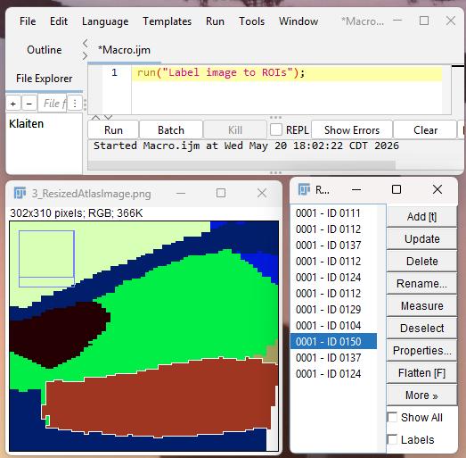

# FIJI Scripts

## Notes for usage of these scripts 

These 5 custom-built .ijm FIJI macro scripts were built with the intentions of following: 

1. **1_CellCounting_InsideandOutsideROI_Final** - draw ROI; select cells; count how many cells are inside and outside ROI

2. **2_FluorescenceMeasurement_InsideROI_Final** - draw ROI; measure fluorescence intensity inside ROI

3. **3_ImageFluorescence_ExclusionGeneration_Final** - from list of images with FITC and TRITC signal, exclude images with non-normal fluorescence in either channel (in an unbiased manner)

4. **4_ImageFluorescence_Colocalization_DrawandAnalyze_Final** - encircle cell bodies (i.e., ROIs); quantify how much FITC, TRITC, and overlap signal lies within each ROI

5. **5_SubregionalCellSegmentation_UsingAtlasRegistrationandPreviousCellSelections_Final** - load image, QUINT-processed atlas alignment, and file with previously hand-selected cell puncta; segment cells subregionally

*See APIs at top of each script for more details.* 

## Details about necessary FIJI plug-ins

3 plugins are necessary (depending on which script is used). 

### For all scripts:
**1. Read and Write Excel package - https://imagej.net/plugins/read-and-write-excel & https://github.com/antinos/Read_and_Write_Excel_Modified**

This plugin can create an excel spreadsheet from a Results table in FIJI.

*see video -* https://www.youtube.com/watch?v=dLkoB25MTIY

*Instructions:* Help --> Update.. --> Manage Update Sites --> "ResultsToExcel" --> restart FIJI

*see more instructions -* https://github.com/antinos/Read_and_Write_Excel_Modified

### For 4_ImageFluorescence_Colocalization_DrawandAnalyze_Final: 
**2. Color Pixel Counter package - https://imagejdocu.list.lu/plugin/color/color_pixel_counter/start**

This plugin can measure how many pixels are of a given color in an RGB color image. 

  

*Instructions:* copy the class file located at that website into the ImageJ plugins folder

### For 5_SubregionalCellSegmentation_UsingAtlasRegistrationandPreviousCellSelections_Final: 
**3. BIOP Label + Region Of Interest + Measure (LaRoMe) package - https://github.com/BIOP/ijp-LaRoMe**

This plugin can create ROIs within same colored pixels, which was then used to then attach subregion names to images. 

  

*Instructions:* Help --> Update.. --> Manage Update Sites --> "PTBIOP" --> restart FIJI

