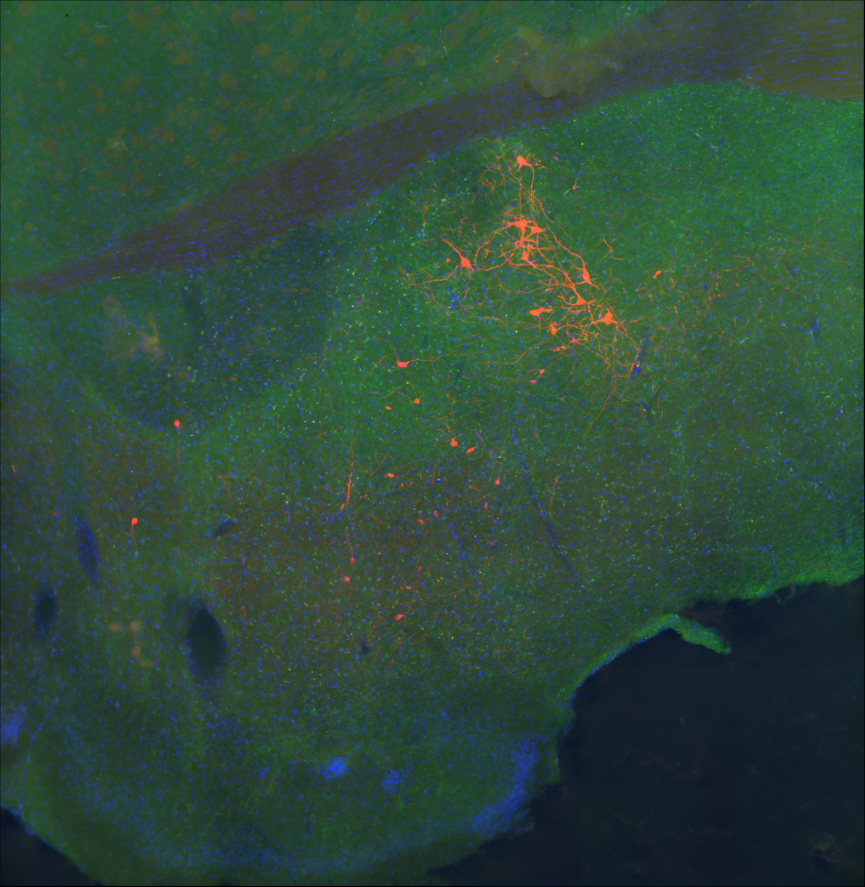
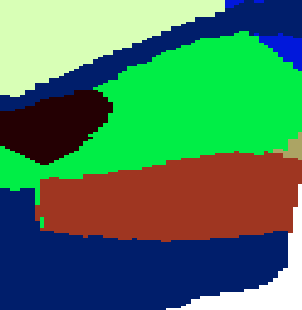
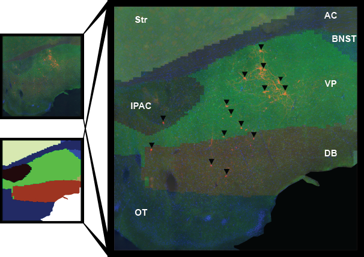

# QUINT Workflow Usage

See detailed protocol, and associated youtube videos, with step-by-steps on how we utilized the workflow. 

Download instructions: https://www.youtube.com/watch?v=7MOUXUPDt-E&list=PL5UhRftRZ7Qp9x5siX7RugO2UywCE-WBv

Workflow instructions (through VisuAlign atlas alignment, no segmentation steps): https://www.youtube.com/watch?v=JjFJbSDzaxw&list=PL5UhRftRZ7Qp9x5siX7RugO2UywCE-WBv&index=2

We used unilateral images of the rat basal forebrain and aligned a rat atlas using features of the QUINT protocol. 

                       

We then used FIJI to resize the aligned image, then segment and quantify subregional expression based on prior hand-counted selections. 

          

NOTE - for use with the CBWJ13 MR-histology rat atlas at age P80 (https://scalablebrainatlas.incf.org/rat/CBWJ13_age_P80; Calabrese et al., 2013), versions of QuickNII and VisuAlign are not available on open-source websites. 

For use of this atlas with QuickNII: 

You must download the “QuickNII-Calabrese_P80_Rat-Test.zip” file from this address (https://www.nesys.uio.no/P80_Rat/). 
If you are interested in using other rat or mouse atlases, see the dropdown menu at the QuickNII download website. 

For use of this atlas with VisuAlign:

You must download the “VisuAlign_cutlas_folder” file from this address (https://www.nesys.uio.no/P80_Rat/), or from our github repository.
Extract, and manually move the contained “Calabrese_P80_Rat.cutlas” folder into the extracted Nutil folder. Only WHS Rat and ABA Mouse atlases are available natively.
